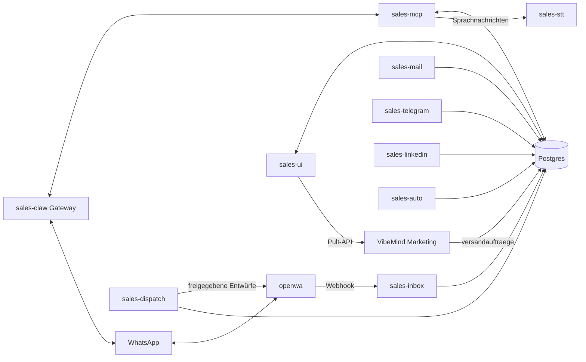

# sales-claw

Selbst gehostete Vertriebs-Arbeitsstation. Ein OpenClaw-Gateway (WhatsApp-Kanal plus Agent) arbeitet mit einem Python-MCP-Server (`sales-mcp`, 89 Werkzeuge) zusammen, der alle ausgehenden Nachrichten hinter eine menschliche Freigabe stellt. Der Agent entwirft, ein Mensch gibt frei, erst dann geht etwas raus.

Das Repo enthält den Code, die Compose-Dateien, die Betriebsskripte und die Doku. Es ist für den Betrieb auf einer eigenen Maschine (Docker, Postgres/Supabase) gedacht, nicht als gehosteter Dienst.

## Was es kann

- CRM: Kontakte (Leads), Aktivitätsverlauf, Personas, Sperrliste.
- Entwürfe für WhatsApp, E-Mail, LinkedIn und Telegram, die ein Mensch freigibt, bevor sie versendet werden.
- Posteingang: eingehende Nachrichten per Webhook, Einordnung, Sprachnachrichten per lokaler Spracherkennung.
- Kalender und Termine, Terminkarten und Einladungen.
- Recherche und Berichte (Markdown-Reports).
- DSGVO-Helfer (siehe unten).
- Newsletter-Editor und Anbindung an den VibeMind-Marketing-Space.
- Bedienoberfläche (`sales-ui`) für den täglichen Gebrauch.

## Aufbau



Die Dienste sprechen über die Datenbank und das Compose-Netz miteinander. Nur Gateway, UI und der WhatsApp-Wirt haben Host-Ports. Details in `docs/02_ARCHITECTURE.md`.

## Dienste

`docker-compose.yml`, Projektname `${LADEN_PROJEKT:-sales-claw}`, Container heißen `${LADEN_PRAEFIX:-sales}-<dienst>`.

| Dienst | Aufgabe |
|---|---|
| `sales-claw` | OpenClaw-Gateway, nur `127.0.0.1`, Host-Port `PORT_GATEWAY` (Standard 18894) |
| `sales-mcp` | MCP-Server, nur im Compose-Netz erreichbar (intern 8765) |
| `sales-dispatch` | versendet freigegebene WhatsApp-Entwürfe über OpenWA |
| `sales-inbox` | nimmt eingehende Nachrichten per Webhook entgegen |
| `sales-mail` | E-Mail-Versand (SMTP) und Postfach |
| `sales-telegram` | Telegram-Chat und -Versand |
| `sales-linkedin` | LinkedIn-Posts, höchstens einer pro Tag |
| `sales-auto` | automatische Antworten; `restart: "no"` |
| `sales-stt` | lokale Spracherkennung für Sprachnachrichten |
| `sales-ui` | serverseitig gerenderte Bedienoberfläche, Host-Port `PORT_UI` (Standard 8791) |

`docker-compose.openwa.yml` startet `openwa`, das WhatsApp-Gateway (Host-Port `PORT_OPENWA`, Standard 12785). Es wird aus einem lokalen Upstream-Klon unter `openwa/` gebaut, der nicht versioniert ist; Patches liegen in `deploy/openwa-patches/`. `docker-compose.proxmox.yml` ist historisch.

Wichtig: `sales-auto` startet nie von selbst. Dienste daher immer namentlich starten, nie mit einem blanken `docker compose up -d`:

```
docker compose up -d --build sales-mcp sales-dispatch sales-inbox sales-ui
```

## Verzeichnisse

| Pfad | Inhalt |
|---|---|
| `sales-mcp/` | Kern: ein Image für sieben Dienste (MCP, Dispatch, Inbox, Mail, Telegram, LinkedIn, UI), Tests in `sales-mcp/tests` |
| `sales-stt/` | Spracherkennung |
| `editor/` | Newsletter-Editor, Fork von email-builder-js (usewaypoint), MIT, siehe `editor/HERKUNFT.md` |
| `deploy/` | Betriebsskripte (bash), `systemd/`-Units, `cron/`, `laeden/beispiel.env`, `openwa-patches/`, `tests/` |
| `db/` | `provision.sql`, `laden-anlegen.sql`, `pruefe-laden.sql` |
| `config/` | `openclaw.json` (Gateway-Vorlage), `workspace/` mit Agent-Anweisungen und Skills |
| `scripts/` | Hilfsskripte für einen Windows-Host (PowerShell/Python), Tests in `scripts/tests` |
| `media/`, `media-erzeugt/`, `reports/` | Laufzeitdaten, Inhalt per `.gitignore` ausgeschlossen |
| `docs/` | Doku, siehe unten |

## Daten und Datenschutz

Postgres (Supabase), Schemas:

- `sales`: Produktion.
- `sales_test`: nur für Tests.
- `sales_<name>`: je weiterer Laden.

Die App verbindet als Rolle `sales_app` ohne DDL- und DELETE-Rechte; `activities` ist append-only. Tabellen u. a.: `leads`, `activities`, `drafts`, `personas` (Vektoren), `benutzer`, `medien_meta`, `kalender_quellen`, `benutzer_mails`, `whatsapp_kopplung`, in Basis-Läden zusätzlich `admin_auftraege`. Die Sperrliste liegt schemaübergreifend in `compliance.sperrliste`.

Das System verarbeitet personenbezogene Daten: Kontakte, Chatverläufe, Entwürfe, Kalendereinträge und Sprachnachrichten. Vor produktivem Einsatz lesen:

- `docs/06_DSGVO.md`
- `docs/07_AVV_VORLAGE.md`
- `docs/08_TOMS.md`
- `docs/09_KI_TRANSPARENZ.md`

## Läden (Mandanten je Teammitglied)

Ein "Laden" ist ein eigener Satz Container, Ports und ein eigenes DB-Schema pro Teammitglied. Kontakte werden nicht geteilt.

Ablauf in Kurzform (ausführlich in `docs/03_RUNBOOK.md`, Abschnitt "Einen zweiten Laden anlegen"):

1. `deploy/laden-anlegen.sh <name> <ports…>` erzeugt `deploy/laeden/<name>.env` nach der Vorlage `deploy/laeden/beispiel.env` (u. a. `LADEN_PROJEKT`, `LADEN_PRAEFIX`, `PORT_GATEWAY`, `PORT_UI`, `PORT_OPENWA`, `SALES_DB_SCHEMA`) und startet nichts.
2. `db/laden-anlegen.sql` legt Schema und Rolle an, `db/pruefe-laden.sql` prüft die Trennung.
3. Dienste namentlich mit `--env-file deploy/laeden/<name>.env` starten.
4. `deploy/cron-saat.sh` und `deploy/gateway-saat.sh` für Cron-Jobs und Gateway-Konfiguration, WhatsApp koppeln (`docs/08_PAIRING_ANLEITUNG.md`), Benutzer mit `deploy/benutzer-anlegen.sh` anlegen.

Alternativ über die UI-Seite `/team/laden-anlegen`: Sie legt einen Admin-Auftrag an, den ein systemd-Timer ausführt.

## Betrieb

| Aufgabe | Skript |
|---|---|
| Ersteinrichtung | `deploy/bootstrap.sh` |
| Update | `deploy/update.sh`: `git fetch` plus ff-only, Tag `vor-update`, gestufter Neubau, danach `deploy/smoke.sh`; bei Rot automatischer Rollback |
| Sicherung | `deploy/sicherung.sh` (täglicher systemd-Timer), Rückspielen mit `deploy/wiederherstellen.sh` |
| Überwachung | `deploy/wache.sh`, alle 15 Minuten per systemd-Timer; Befunde landen im Auftrags-Spool |
| Abnahme | `deploy/smoke.sh` |

Die systemd-Units liegen in `deploy/systemd/`. Betriebsdoku für die Zielmaschine: `docs/04_BETRIEB_MINIPC.md`, täglicher Gebrauch: `docs/05_BEDIENUNG.md`, Notfall: `docs/05_DISASTER_RECOVERY.md`, Schlüssel tauschen: `docs/10_SECRETS_ROTATION.md`.

## Tests

Container-Suite (nur gegen `sales_test`, nie gegen `sales`):

```
docker build -t sales-mcp:dev sales-mcp
docker run --rm --env-file .env -e SALES_DB_SCHEMA=sales_test sales-mcp:dev python -m pytest -q
```

Es muss `python -m pytest` sein, nicht `pytest` direkt (Importpfad, Begründung im Runbook). Host-Suite:

```
python -m pytest scripts/tests
```

CI: `.github/workflows/tests.yml` mit den Jobs `container-suite` und `host-suite`. Die Skripttests unter `deploy/tests/` laufen separat.

## Konfiguration

Vorlagen: `.env.example`, `tailscale-admin.env.example`, `deploy/laeden/beispiel.env`. Die Beispieldateien enthalten keine echten Werte; `.env` nie einchecken. Nur Namen:

- Datenbank und UI: `SALES_DB_URL`, `SALES_DB_SCHEMA`, `UI_SESSION_SECRET`, `TZ`, `UI_TAILSCALE_IP`.
- Pro Laden: `LADEN_PROJEKT`, `LADEN_PRAEFIX`, `PORT_GATEWAY`, `PORT_UI`, `PORT_OPENWA`.
- Modelle: `OPENROUTER_API_KEY`, `OPENAI_API_KEY`, `ANTHROPIC_API_KEY`.
- WhatsApp und Posteingang: `OPENWA_API_KEY`, `OPENWA_SESSION_ID`, `INBOX_WEBHOOK_SECRET`, `INBOX_UNBEKANNT_LEAD_ID`.
- E-Mail: `SMTP_HOST`, `SMTP_PORT`, `SMTP_USER`, `SMTP_PASSWORT`, `EMAIL_ABSENDER`.
- LinkedIn: `LINKEDIN_ACCESS_TOKEN`, `LINKEDIN_PERSON_URN`, `LINKEDIN_API_VERSION`, `LINKEDIN_POST_LEAD_ID`.
- Telegram: `TELEGRAM_BOT_TOKEN`; Meldungen an den Betreiber: `TELEGRAM_CHAT_ID` (in `tailscale-admin.env`).
- Recherche: `APIFY_TOKEN`, `RECHERCHE_LEAD_ID`.
- Konferenzen: `KONFERENZ_ANBIETER`, `GOOGLE_MEET_CLIENT_ID`, `GOOGLE_MEET_CLIENT_SECRET`, `GOOGLE_MEET_REFRESH_TOKEN`.
- Wissensbasis: `ROWBOAT_URL`, `ROWBOAT_PROJECT_ID`, `ROWBOAT_API_KEY`.
- Marketing-Anbindung: `MARKETING_PULT_URL`, `MARKETING_PULT_KEY`.
- Tailnet-Verwaltung (Einladungen): `TAILSCALE_API_KEY`, `TAILSCALE_TAILNET`.

## Verhältnis zu VibeMind Marketing

sales-claw ist der einzige Versandweg für VibeMind Marketing (Betreiber-Entscheidung vom 2026-09-12). Marketing legt Aufträge in `marketing.versandauftraege` ab; sales-claw macht daraus je Auftrag höchstens einen Entwurf, der durch dieselben Freigabe-Schranken läuft wie jeder andere (`sales-mcp/lead_fluss.py`, die `versandauftraege`-Werkzeuge in `sales-mcp/server.py`).

Die Marketing-Seiten der UI sprechen über `sales-mcp/marketing_pult.py` mit dem Marketing-Pult (`MARKETING_PULT_URL`, `MARKETING_PULT_KEY`). Auf der Zielmaschine aktualisiert `deploy/marketing-aktualisieren.sh` einen Sparse-Checkout des Marketing-Spaces, `deploy/systemd/marketing-api.service` betreibt ihn.

## Weiterführende Doku

| Datei | Inhalt |
|---|---|
| `docs/01_OVERVIEW.md` | Überblick (teilweise veraltet, u. a. "Umzug vorbereitet" und der Hinweis zum Auto-Modus) |
| `docs/02_ARCHITECTURE.md` | Architektur |
| `docs/03_RUNBOOK.md` | Runbook: Tests, zweiten Laden anlegen, Störungen |
| `docs/04_BACKUP_RESTORE.md` | Sicherung und Wiederherstellung |
| `docs/04_BETRIEB_MINIPC.md` | Betrieb auf der Zielmaschine |
| `docs/05_BEDIENUNG.md` | Tägliche Bedienung |
| `docs/05_DISASTER_RECOVERY.md` | Notfallwiederherstellung |
| `docs/06_DEMO_ABNAHME.md` | Demo und Abnahme |
| `docs/06_DSGVO.md` | Datenschutz |
| `docs/07_AVV_VORLAGE.md` | Vorlage Auftragsverarbeitung |
| `docs/07_PROXMOX_PILOT.md` | Proxmox-Pilot |
| `docs/08_PAIRING_ANLEITUNG.md` | WhatsApp koppeln |
| `docs/08_TOMS.md` | Technische und organisatorische Maßnahmen |
| `docs/09_KI_TRANSPARENZ.md` | KI-Transparenz |
| `docs/10_SECRETS_ROTATION.md` | Schlüsselrotation |
| `docs/11_INBETRIEBNAHME.md` | Inbetriebnahme (historisch) |
| `docs/moegliche-erweiterungen/` | Ideen und Vorschläge |
| `docs/superpowers/` | Specs und Pläne je Ausbaustufe |

## Lizenz

Noch nicht festgelegt, im Repo gibt es keine `LICENSE`-Datei im Wurzelverzeichnis. `editor/` steht als Fork unter MIT, siehe `editor/LICENSE`.
